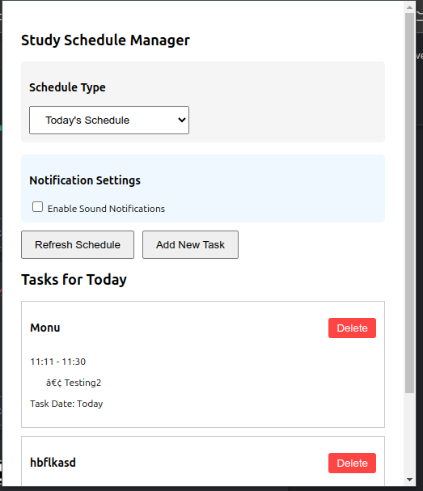
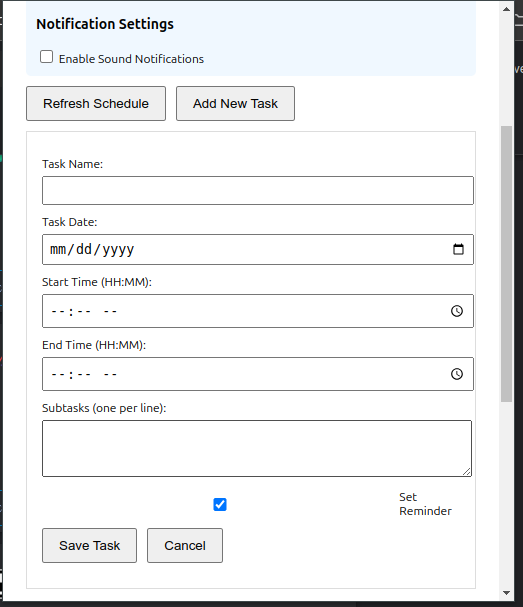
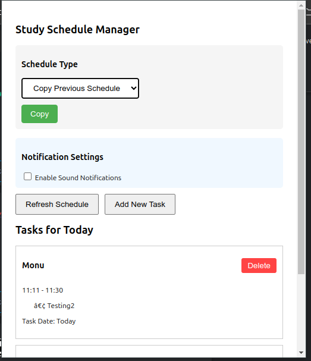

# Study Schedule Reminder

## Overview

The Study Schedule Reminder is a Chrome extension designed to help you manage your study schedule and tasks efficiently. It provides notifications for upcoming tasks and allows you to manage your schedule directly from the extension popup.

## Features

- Add, edit, and delete tasks for specific dates.
- Receive notifications for upcoming tasks.
- Customize notification sounds and reminder times.
- Copy schedules from previous days.
- View and manage tasks for today or any custom date.

## Installation

1. Clone the repository:
    ```bash
    git clone https://github.com/yourusername/study-schedule-reminder.git
    ```
2. Navigate to the project directory:
    ```bash
    cd study-schedule-reminder
    ```
3. Install the required Python packages:
    ```bash
    pip install -r requirements.txt
    ```
4. Run the Flask server:
    ```bash
    python extension.py
    ```
5. Load the extension in Chrome:
    - Open Chrome and go to `chrome://extensions/`.
    - Enable "Developer mode" in the top right corner.
    - Click "Load unpacked" and select the project directory.

## Usage

1. Open the extension popup by clicking on the extension icon in the Chrome toolbar.
2. Use the "Schedule Type" dropdown to select today's schedule, a custom date, or copy a previous schedule.
3. Add new tasks by clicking the "Add New Task" button and filling out the task form.
4. Enable sound notifications and customize reminder times and sounds in the "Notification Settings" section.
5. Refresh the schedule by clicking the "Refresh Schedule" button.

## Notification Sounds

Place your notification sound files in the `notification_sounds` directory:
- `notification.mp3` (default)
- `urgent.mp3`
- `gentle.mp3`
- `meeting.mp3`

You can download free sound files from:
1. [Notification Sounds](https://notificationsounds.com/)
2. [Sound Bible](https://soundbible.com/)
3. [Freesound](https://freesound.org/)

## Issues and Resolutions

### Issue: Missing `dbus` Package

**Problem:** The `plyer` library requires the `dbus` package for notifications on Linux. If the package is missing, you may see the following warning:
```
UserWarning: The Python dbus package is not installed.
Try installing it with your distribution's package manager, it is usually called python-dbus or python3-dbus, but you might have to try dbus-python instead, e.g. when using pip.
```

**Solution:** Install the `dbus` package using your distribution's package manager. For example, on Ubuntu, you can run:
```bash
sudo apt-get install python3-dbus
```

### Issue: Sound Playback Error

**Problem:** The sound playback may fail if the specified sound file is not found or not properly loaded. You may see the following error:
```
Sound playback error: 'default'
```

**Solution:** Ensure that the 'default' sound file exists in the `notification_sounds` directory and handle the case where it might be missing. The code has been updated to check for the existence of the sound file and raise an appropriate error if it is not found.

### Issue: Notification Support

**Problem:** Notifications may not work as expected in confined environments, such as when running in a sandboxed environment. You may see the following warning:
```
libnotify-WARNING **: Running in confined mode, using Portal notifications. Some features and hints won't be supported
```

**Solution:** This is a known limitation and may require further investigation to fully resolve. Ensure that your environment supports notifications and consider testing on different platforms.

## Screenshots

### Extension Popup


### Task Form


### Notification Example


## Future Improvements

- Improve notification support and compatibility across different environments.
- Add more customization options for notifications and sounds.
- Enhance the user interface for better usability.

## References

- [Plyer Documentation](https://plyer.readthedocs.io/en/latest/)
- [Flask Documentation](https://flask.palletsprojects.com/en/2.0.x/)
- [Chrome Extensions Documentation](https://developer.chrome.com/docs/extensions/mv3/)

## License

This project is licensed under the MIT License. See the [LICENSE](LICENSE) file for details.

## Important Logic and Considerations

### Background Script

The background script (`background.js`) is responsible for checking reminders and fetching the schedule from the Python server. It runs in the background and periodically checks if there are any tasks that need to be notified.

### Popup Script

The popup script (`popup.js`) handles the user interactions within the extension popup. It allows users to add, edit, and delete tasks, as well as customize notification settings.

### Flask Server

The Flask server (`extension.py`) serves as the backend for the extension. It handles requests to add, delete, and fetch tasks. It also manages the schedule files and ensures that tasks are stored and retrieved correctly.

### Notification Sounds

Notification sounds are stored in the `notification_sounds` directory. The extension supports multiple sound files, and users can customize the notification sound for each task. Ensure that the sound files are in the correct format and placed in the appropriate directory.

### Customizable Notification Gap

The notification gap (time before the task start/end time when the notification should be triggered) is customizable. The default gap is set to 5 minutes, but users can change it through the notification settings in the popup.

### Error Handling

The code includes error handling for various scenarios, such as missing sound files, time conflicts between tasks, and issues with fetching the schedule from the server. Ensure that the error messages are clear and provide guidance on how to resolve the issues.

### Testing and Debugging

- Test the extension on different platforms (Windows, macOS, Linux) to ensure compatibility.
- Verify that notifications work as expected in different environments.
- Check the console for any error messages and address them promptly.

### Contribution

If you encounter any issues or have suggestions for improvements, feel free to open an issue or submit a pull request on the GitHub repository.
